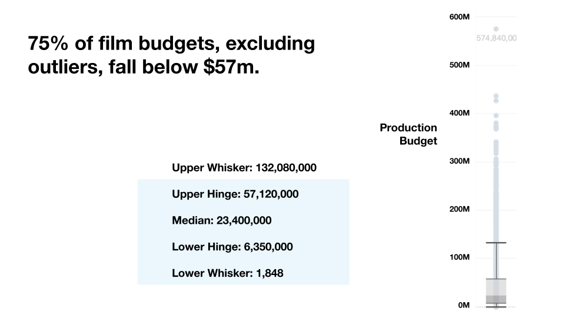
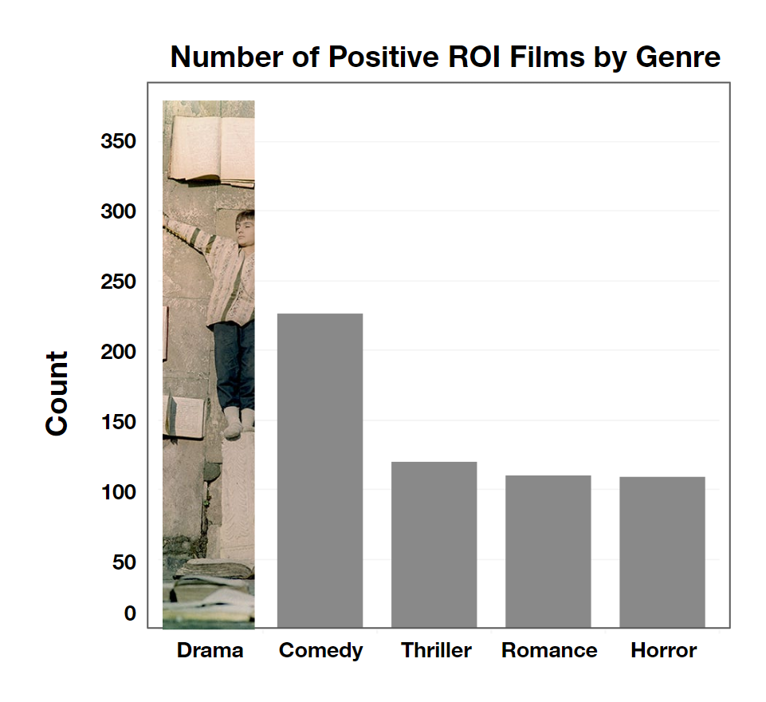
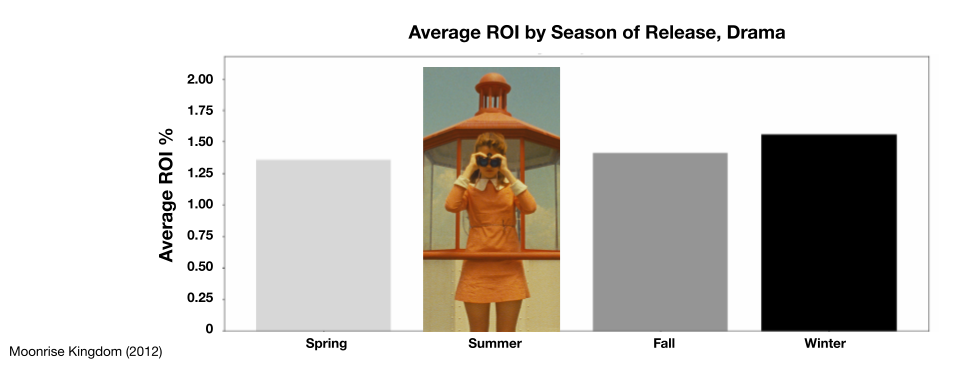
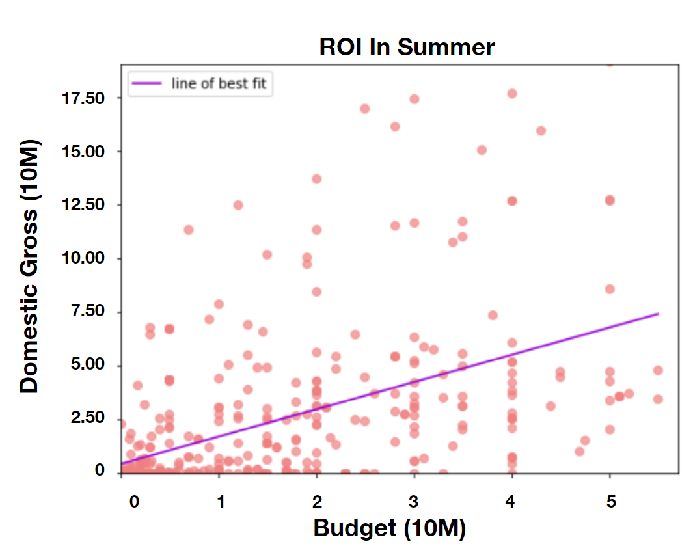

# DO be dramatic

**Authors**: Marley Lopez, Andy Shen, John Baumgartner


## Business Problem

Our company wants to create a new movie studio, but they don’t know anything about creating movies. We are charged with exploring what types of films are currently doing the best at the box office. We then translate those findings into actionable insights that the head of our company's new movie studio can use to help decide what type of films to create.

## Data Understanding

We analyzed several databases including:
- Box Office Mojo
- IMDB
- Rotten Tomatoes
- TheMovieDB
- The Numbers

These data sets contained information about release dates, domestic gross, worldwide gross, budget, rating, genre, actors, actresses, and directors. We analyzed these datasets to draw several conclusions. 

We found that The Numbers database had similar information columns to Box Office Mojo, but more entries, and more precise numbers (Box Office Mojo had rounded values). Similarly, both Rotten Tomatoes and IMDB had genre and rating categories, but IMDB had both more entries and more data entries.

## Data Preparation
First we cleaned The Numbers database so that *release_date* and *movie* are strings, and *production_budget, domestic_gross,* and  *worldwide_gross* are integers.

We created new columns *DG_AI* (domestic gross after inflation) and *PB_AI* (production budget after inflation) to have a more accurate view of movie budget & return within the years.

Next we created a column *season* based off of dates, to be able to view trends based on season.

We also created the feature *ROI* which is *domestic_gross / production_budget.*

Next we joined the IMDB databases we need, *movie_basics*, and *movie_ratings* into a dataframe called *joinedIMDB.*

We combined The Numbers database with *joinedIMDB* into our masterdataframe, **movie_df**.

Within this new database, we created binary flags for each of the 19 genres used by IMDB.

Final dataset N = 2203


## Data Analysis

Thus we used a customized dataset which combined The Numbers database and IMDB's "movie_basics" and "movie_ratings" tables to get an overview of which movies have the highest domestic gross and return on investment. We are also interested in what time of year popular and successful movies are released to understand what genres perform the best during which seasons.

### Setting the Budget 


We found the 75th percentile of all film budgets within our data set to be $57,120,000. We did this to determine what a new film studio like ours should expect to spend. Using this number, we further filtered our data to exclude films above that budget range. 

### Accentuate the Postive


The most popular genre to produce with a consistently positive ROI is Drama. 

IMDB defines Drama as: 

    Should contain numerous consecutive scenes of characters portrayed to effect a serious narrative throughout the title, usually involving conflicts and emotions. This can be exaggerated upon to produce melodrama.

### Season Premiere


Summer is the best season to release a Drama. The average ROI for Drama films released in the Summer is near 200%.


### Predicting ROI


We can predict the outcome of a dramatic premier in Summer for a studio working within a budget of $57 million to be a domestic gross of $61 million. 

## Conclusion

After conducting data analysis, we recommend our first film be a Drama with a Budget of $57 million, slotted for a summer release date. This has the best probability of commercial success for our business. 


## Further Investigation

- Expand to NLP models and streaming data to study long-term profits of franchises and holiday films.
- Review more recent data to confirm trends.
- Look into international expansion.


## Additional Resources

- <p><a href="https://data.bls.gov/cgi-bin/cpicalc.pl">Government Inflation Calculator</a></p>
- <p><a href="https://help.imdb.com/article/contribution/titles/genres/GZDRMS6R742JRGAG">IMDB Genres</a></p>
- <p><a href="https://americanfilmmarket.com/types-3m-10m-films-break/">Low Budget Hits</a></p>
- <p><a href="https://www.nytimes.com/2023/10/20/business/media/apple-killers-of-the-flower-moon-theaters.html?searchResultPosition=22">Apple's Box Office Strategy</a></p>
- <p><a href="https://independent-magazine.org/2022/10/22/the-demise-of-mid-budget-cinema/">The Demise of Mid-Budget Cinema</a></p>
- <p><a href="https://www.bbc.com/culture/article/20130620-is-china-hollywoods-future">Global Box Office Effect</a></p>

## For More Information

Please visit our full analysis in our [Jupyter Notebook](./index.ipynb) and  [Slide Presentation](./MoviePresentation.pdf).

For more questions, please feel free to reach us: 

**Marley Lopez | github.com/0le-worm**

**Andy Shen | github.com/bubblenator**

**John Baumgartner | github.com/jbaumgit**


## Repository Structure

You are currently in the README.md file. The 'index.ipynb' file contains the jupyter notebook of the explaratory analysis of the given data that provides step-by-step guide to how we came to our conclusion. 'Images' file contains the images used in this file. The images were taken from the internet.

```
├── Data                    <- Data file used in this project
├── Images                  <- Images and Graphs used in this project obtained from external and internal source
├── .gitignore              <- Contains list of files to be ignored from GitHub
├── MoviePresentation.pdf   <- Slide Presentation of the project
├── README.md               <- Contains README file to be reviewed    
└── index.ipynb             <- Jupyter notebook of the project containing codes and analysis
```
